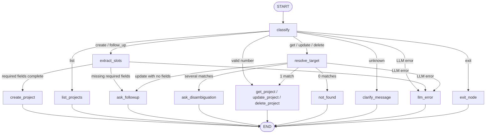

# Console Project Agent

A stdin/stdout app that uses LangChain + LangGraph and a local Ollama model to manage a project list stored in JSON.

## Requirements

- Python 3.10+
- [Ollama](https://ollama.com/) running locally

No cloud API key is required.

## LLM provider and model

| Item | Value |
| --- | --- |
| Provider | Ollama only |
| Verified model | `llama3.2` |
| Default URL | `http://localhost:11434` |

This project does not implement OpenRouter or any other cloud LLM path.

## Install

From the project root:

```bash
python -m venv .venv
```

Windows:

```powershell
.\.venv\Scripts\Activate.ps1
python -m pip install -r requirements.txt
python -m pip install -e .
```

macOS / Linux:

```bash
source .venv/bin/activate
python -m pip install -r requirements.txt
python -m pip install -e .
```

Pull the verified model and start Ollama:

```bash
ollama pull llama3.2
ollama serve
```

Copy the example env file (optional; defaults already match the verified setup):

```bash
cp .env.example .env
```

On Windows PowerShell: `Copy-Item .env.example .env`

`.env` may contain:

```text
LLM_PROVIDER=ollama
LLM_MODEL=llama3.2
# OLLAMA_BASE_URL=http://localhost:11434
# PROJECTS_JSON_PATH=data/projects.json
```

## Run

One official command, from the project root with the virtualenv active and Ollama running:

```bash
python -m project_agent.main
```

On start the app prints a short banner and welcome text, then the `> ` prompt. Type natural language there. Type `quit` or `exit` to leave.

Projects are saved to `data/projects.json`. If that file is missing it is treated as an empty list. If it is corrupt, the app reports an English error and does not overwrite it.

## LangGraph workflow

Each line of input is one LangGraph turn.




1. `classify` routes the line to `create`, `list`, `get`, `update`, `delete`, `exit`, or `unknown`.
2. `create` goes to `extract_slots`. Required fields are `project_name` and `customer`. Optional fields (`start_date`, `location`, `status`, `notes`) are stored only if they appear in the sentence. Missing required fields are listed in one follow-up; a later line can fill them. Any new intent cancels an unfinished draft.
3. `list` reads `data/projects.json` and prints a numbered list, or says that no projects exist.
4. `get` / `update` / `delete` look up by project name (case-insensitive). One match runs the action. Several matches are disambiguated by number. Zero matches return `No project named "..." was found.` Delete does not ask for confirmation.
5. `unknown` explains the available actions. `quit` / `exit` print `Goodbye.` and end the process.

Successful creates, updates, and deletes are written immediately to JSON. The chat model is served by local Ollama.

## Example sessions

These match the verified English replies. `id` values are generated at runtime and will differ on your machine.

### 1. Create and list (assignment golden path)

```text
> list projects
No projects found. Create one by describing it in natural language.

> create a project called Alpha for customer Acme
Done. Created project "Alpha" for customer Acme.

> create project Beta for Globex
Done. Created project "Beta" for customer Globex.

> list projects
Here are your projects (2):
1. Alpha — customer: Acme
2. Beta — customer: Globex

```

### 2. Missing field follow-up

```text
> Can you create a project
I still need the project name and the customer to create this project.

> Can you create a proejct called GAMMA
I still need the customer name for this project.

> the customer is Amy
Done. Created project "GAMMA" for customer Amy.
```

### 3. Delete when two projects share a name

```text
> list projects      
Here are your projects (4):
1. Alpha — customer: Acme
2. Beta — customer: Globex
3. GAMMA — customer: the customer is Amy
4. Alpha — customer: Globex

> delete Alpha 
Multiple projects named "Alpha" were found. Reply with a number:
1. Alpha — customer: Acme — id: 6c88fc7b-4591-4cc9-b7bc-1347860ebdec
2. Alpha — customer: Globex — id: 2cc759d9-928f-45ca-8dbf-f600cd30421c

> 2      
Done. Deleted project "Alpha" for customer Globex (id: 2cc759d9-928f-45ca-8dbf-f600cd30421c).
```
